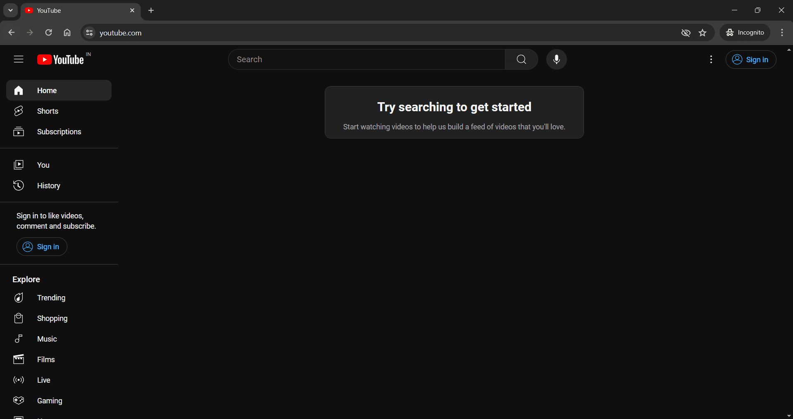

# YouTube Automation

`Selenium` `Xpath` `TestNG`

---

This project involves automating the YouTube video streaming website, and asserting on various properties such as number of likes, views etc.

---

# Overview
This project involves automating the YouTube video streaming website, covering URL validation, message extraction from the "About" section, film rating and genre verification in the "Top Selling" section, playlist name and track count checks in the "Music" tab, and summarizing likes on the first three "Latest News Posts" from the News tab. Utilize DataProvider to search for various items from a dataset.

# Automating YouTube
## Scope of work
* Automated the following test cases:
    * Went to YouTube.com and Asserted we are on the correct URL. Clicked on "About" at the bottom of the sidebar, and printed the message on the screen.
    * Went to the "Films" tab and in the "Top Selling" section, scrolled to the extreme right. Applied a Soft Assert on whether the movie is marked "A" for Mature or not. Applied a Soft assert on whether the movie is either "Comedy" or "Animation".
    * Went to the "Music" tab and in the 1st section, scrolled to the extreme right. Printed the name of the playlist. Soft Assert on whether the number of tracks listed is less than or equal to 50.
    * Went to the "News" tab and printed the title and body of the 1st 3 "Latest News Posts" along with the sum of the number of likes on all 3 of them.
    * Searched for each of the items given in [excel sheet](src/test/resources/itemsToSearch.xlsx) and keep scrolling till the sum of each video's views reach 10 Cr.

## Skills used
`Selenium` `Xpath` `TestNG`

---

# Prerequisites
1. Java 21
2. Gradle 7.5.1
3. VS Code 1.89.1

# Installation Instructions
Clear steps to set up and run the project locally.
1. Make clone of this repo
2. Open in VS code IDE
3. Build using `./gradlew build` command
4. Run test using `./gradlew test` command

# Important Links
1. [YouTube](https://www.youtube.com)
2. [Test Cases](https://docs.google.com/spreadsheets/d/1ZGFr9LXhcevIBMi598EYstmmKtGeDMFyqiW_Smgf-RY/edit?usp=sharing)

# Screenshots

> YouTube Web Application
